# Yaomi Phone

显示名称已由 Lumi 改为 Yaomi；目录、构建目标与运行命令仍为 `phone_shell`。

使用 YMGUI 制作的 320×480 手机界面演示：开机、三页桌面、16 个内置应用、返回桌面、两列最近任务、清理和关机/重启。它是单进程 UI 原型，不是 Android 或实际手机操作系统；“后台清理”清除的是演示应用的运行状态，并非 OS 进程。

桌面可左右滑动、滚轮或点按页码圆点翻页：第一页待办/音乐/相册/设置，第二页时钟/天气/笔记/计算器/电话/短信/通讯录/录音机，第三页文件管理/陀螺仪/相机/浏览器。后两页只有图标和应用名，不放标题、说明卡片或播放器。图标、标签和空白处均可开始滑动，拖动不误打开应用；返回桌面保留应用所在页，在桌面再次按 Home 回第一页。状态栏和三键导航固定，播放器只在第一页显示，翻页内容独立裁剪并松手吸附。16 个应用统一采用浅色内容区。字体采用共享基线的四档比例 4bpp 字模；RGB565 壁纸使用有序抖动缓解渐变色带，SDL 保持 1:1 显示。

- 待办：原生 Checkbox 换肤、最多五项示例任务、完成进度 Bar，以及新增行入场。
- 音乐：播放状态、可拖动的原生 Slider 进度和桌面播放器同步，无音频输出；灰色前后曲图标是不可操作的视觉标记。
- 相册：三种绘制风景的颜色过渡，不含外部照片。
- 设置：原生 Switch 的网络示例状态/壁纸切换，原生 Slider 调整屏幕预览明暗；设备名称输入框也自动调用统一键盘，不控制真实网络或硬件亮度。**七项卡片超出可视区，本页改成了可上下滚动并带一根自绘滚动条**（上游 YMGUI 有滚动语义但没有滚动条控件，属本工程新增；实现与几何见 `docs/SCROLL_VIEW.md`）。
- 时钟：可开始、暂停、重置的秒表；不是系统时间或闹钟服务。
- 天气：三个城市的离线示例天气切换，不访问网络。
- 笔记：真正可编辑的标题（TextInput，127 字节）与正文（EditView，4096 字节），支持中文、光标、选区、换行和置顶。内容在本次进程内保留，未做磁盘保存。
- 计算器：九位整数四则运算，除零和结果越界有保护；除法取整数部分。
- 电话：数字键盘、删除、模拟拨号/挂断与计时；不连接运营商，不呼出电话。
- 短信：收件人和多行正文可编辑，空内容校验与模拟发送状态；不会发送真实短信。
- 通讯录：四个示例联系人、中文/号码搜索、选择后进入电话或短信并带入号码；不是系统联系人。
- 录音机：开始/停止、计时与示例电平条，停止产生会话内演示记录；不采集麦克风、没有音频文件，电平过渡复用 ANIM。
- 文件管理器：虚拟照片/录音/笔记/下载目录，打开、返回上级及跳转相册/笔记；不读写真实文件系统。
- 陀螺仪：原生 Joystick 拖动模拟 X/Y 姿态与归零，Z 固定为 0；未接传感器。
- 相机：原生绘图组成模拟取景、辅助网格和快门。快门打开中文 MsgBox；可关闭弹窗或关闭应用返回桌面，不调用摄像头或拍照。
- 浏览器：地址栏、示例网页卡片与打开/关闭弹窗；不联网、不包含网页引擎，不解析输入的网址。与相机一样先做视觉样机，真实能力按需接入。
- 最近应用：类似双列手机后台的 136×206 卡片，保留应用实际渲染帧的双线性缩略图。上下拖动/滚轮浏览，横向划走单卡、右上角关闭、点击恢复、一键按当前左右列向两侧散开清理（保留纵坐标，包含滚动到下方的卡片）。首个有效位移锁定手势方向，纵向滚动不会误关闭；取消恢复原位和滚动量。卡片区裁剪，标题和清理按钮固定，关闭后剩余卡片重排。卡片阴影严格限制在对象失效边界内，避免移动后留下边缘残影。
- 系统流程：应用从实际点击的图标处展开，启动图标按当前展开窗口居中排版，330ms 展开完成后显示内容；音乐区分桌面图标与底部播放器入口。退出收回、后台入场、top_layer 关机确认面板及模态拦截、开机/关机/重启保持统一流程。

复用 YMGUI 的对象树、子裁剪、分块刷新、指针捕获、Checkbox/Switch/Slider/Bar 以及 ANIM 的位置/尺寸/颜色/值补间。标准控件只换绘制回调，不替换其私有数据或原生事件处理。无核心 API 修改、外部场景库或图片依赖。应用级字体由 DejaVu Sans 离线生成，附带 [字体许可](assets/FONT_LICENSE.txt)，构建无需 Pillow 或系统字体。

```sh
cmake -S project_Demo/phone_shell -B build/rgb565/project_Demo/phone_shell -DYMGUI_COLOR_DEPTH=16 -DYMGUI_ANIM=ON
cmake --build build/rgb565/project_Demo/phone_shell
build/rgb565/project_Demo/phone_shell/phone_shell
```

底部从左到右为返回、桌面、后台。设置的“关机...” 或桌面键的右键/触摸长按打开关机确认；点击遮罩或“取消”关闭。关闭任意应用只移除演示运行标记和快照，任务、设置与笔记仍保留至进程退出。时间、天气、电量均为固定示例数据，无真实手机系统服务。

`--home`、`--home2`、`--home3`、`--tasks`、`--music`、`--gallery`、`--settings`、`--clock`、`--weather`、`--notes`、`--calculator`、`--phone`、`--messages`、`--contacts`、`--recorder`、`--files`、`--gyroscope`、`--camera`、`--browser`、`--camera-dialog`、`--browser-dialog`、`--ime`、`--clear-mid`、`--clear-done`、`--recents`、`--dialog`、`--power`、`--boot` 提供有限帧预览。后台预览会先实际渲染16 个 App 再生成缩略图。无头交互测试：

```sh
ctest --test-dir build/rgb565/project_Demo/phone_shell --output-on-failure
# 或直接运行
SDL_VIDEODRIVER=dummy build/rgb565/project_Demo/phone_shell/phone_shell --selftest
```

`YMGUI_ANIM=OFF` 时相同的流程即时切换，不依赖 ANIM 源码或符号，分页、拖动和原生控件仍可用。独立应用有两项 CTest（界面交互与注册表生命周期），不改变根工程测试数量。覆盖图标起手翻页/取消/页边界/返回原页、16 个入口逐一打开、基础应用交互、相机/浏览器弹窗打开/关闭/模态拦截与快照释放、除零保护、16 张真实快照/两列定位/底部滚动钳制/取消/横划关闭/清理释放，以及原有任务、播放、设置、模态与开关机流程。

启动过程检查：`--launch-start-<key>` 和 `--launch-mid-<key>` 分别冻结首帧和 120ms 时刻，例如 `--launch-start-tasks`、`--launch-mid-browser`；关闭 ANIM 时直接显示内容。自检额外覆盖 16 个入口首帧实际像素、展开居中/裁剪、330ms 完成时序、音乐双入口，以及过渡局部刷新与完整重绘的一致性。

资源边界：真实快照按打开应用分配，每项 `320×448×sizeof(GYpx)`（RGB565 为 280 KiB，16 项 4480 KiB；RGB888 为每项 420 KiB，16 项 6720 KiB）。关闭应用、清理、重启或进程退出释放；分配失败时后台显示图标占位。另有一个与 48 行 draw buffer 等大的明暗处理缓冲。这是资源较充足目标的应用级演示，不能把这些 RAM 开销算作 YMGUI/ANIM 核心要求。

## 桌面框架与模块化 APP

现在是静态注册的手机应用框架：16 个 APP 各自独立编译，界面/状态/事件均在 `apps/<名称>.c` 私有保存；原来的 `phone_apps.inc` 已由这些模块替代。

- `phone_app_catalog.def` 是唯一注册清单，C 枚举、描述符表和 CMake 源文件列表共用；桌面标题/颜色/图标及预览参数来自 APP 描述符。
- `phone_app.c/.h` 统一派发 create/show/hide/tick/back/close/destroy，回桌面保留会话，清理停止活动，退出销毁。
- `phone_host.h` 提供跳转/关闭/提示/关机/主题/亮度/桌面播放状态服务；通讯录通过打开参数传号码，文件管理通过查询取录音记录数，不直接访问其他 APP 的变量或控件。
- `phone_ui.c/.h` 提供公共皮肤和现有 ANIM 封装，输入服务和字体模块继续独立。
- `phone_launcher.c/.h` 自动计算页数、换行位置与启动位置。第一页 4 个，其后每页 8 个、每行 4 个；目前三页，超过 20 个自动扩页。

新增 APP 通常只需一个源文件和一行注册，已有 [可复制模板](apps/example.c.in)；详细步骤和生命周期契约见 [APP 接入指南](APP_GUIDE.md)。额外第 17 个模板应用已在临时构建中验证接入，正式桌面仍为 16 个。

边界：单 context、每 APP 单实例、启动时创建全部视图；不是动态插件/运行时安装，也没有持久化。关闭 APP 保留控件与会话内容，只停止活动/释放后台快照，退出才销毁。APP 内部仍主要为固定坐标，不是响应式布局。内建功能存在显式依赖，不承诺从编译清单任意删去一个 APP 即可自动处理其调用方。

### 桌面长按、拖拽与菜单

触摸长按图标（桌面 SDL 也可右键）显示小菜单：应用信息、卸载。长按后继续拖动会收起菜单、显示浮动图标和落点标记，松手按网格插入重排；在左右边缘停留 550ms 自动翻页，可跨页移动，取消手势恢复原顺序/页码。普通短滑仍翻页，不触发编辑或打开应用。动画落位仍调用已有 ANIM。

`phone_launcher` 保存独立的顺序模型，`phone_desktop.c/.h` 管理图标、菜单和编辑手势；APP ID/注册表不变，移动后的点击、启动位置与退出位置跟随新位置（音乐底座仍是独立固定入口）。不是任意像素摆放、文件夹或拖动快捷面板。

“卸载”有确认，仅移除本次演示的入口、关闭该应用活动并释放后台快照，保留代码/资源和会话控件内容；其他入口请求打开被移除应用会返回失败。长按桌面空白处选择“恢复默认桌面”可恢复所有入口及默认顺序。状态只保留本次进程，重新启动程序回默认；演示内开关机不重新排列桌面。分页容器仍按注册容量保留，不因移除入口缩页。

`--home-menu` / `--home-drag` 可预览长按菜单与拖拽中途。自检覆盖长按不误开、同页与跨页移动、取消恢复、新位置启动、信息弹窗、卸载取消/确认/快照释放/拒绝打开及恢复入口。

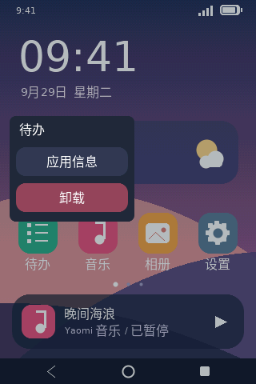 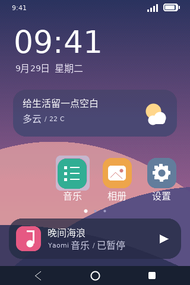

## 统一输入法

默认 `YAOMI_IME=ON`。笔记标题/正文、设备名称、号码、短信、搜索和示例地址栏共用一套底部键盘：点击/聚焦输入框自动弹出，切换输入框重新定位输入目标并清空未提交拼音；按返回先收键盘，再按返回才离开应用。进入后台/桌面、打开关机面板、隐藏或销毁输入目标都会解除输入法。软键按下/取消不丢焦点，点击拼音栏也不会关闭键盘。

底行依次为「符号 / 123 / 空格 / 中英 / 回车」。「符号」打开独立分类页，与桌面输入法共用 [ime_symbols.h](../chinese_ime/ime_symbols.h)：常用、数学、角标、序号、希腊、拼音、箭头七类共 489 项，另有 72 项英文常用符号；每页 3×5 项、两行分类键，末页隐藏空位。符号页的 `< >` 用于符号翻页，中英键切换常用符号表并回第一页，ABC 返回字母键盘；打开符号页先提交未完成拼音的首候选。`123` 独立保留快捷数字/标点输入。

普通候选栏没有未提交拼音时，右侧合为「收起」；有拼音时显示 `< >` 翻页（即使尚无匹配候选也不变成收起）。回车先上屏当前页首选词，无候选时上屏原拼音，再执行多行换行或单行提交；多行框保持键盘打开。输入框已有文字不会妨碍收起，判断依据仅为未提交拼音。`--ime` 预览候选状态，`--ime-idle` 预览收起状态，`--symbols` 预览分类符号。

支持中文拼音/词组/简拼候选、按实际宽度分页、点选或数字选词、空格首选、英文直接输入、大小写、数字符号、退格和换行。多行 Enter 换行，单行 Enter 提交并收起；候选在光标位置插入或替换选区。编辑区域被键盘遮挡时临时缩小/上移，收起后恢复。原生控件继续负责编辑、选区、滚动与剪贴板。界面标题、按钮、状态和示例内容优先中文；ASCII 仍采用应用比例字体，非 ASCII 文本按 UTF-8 解码后使用 GB2312 字形，自绘标签裁到对象边界。`phone_locale.c/.h` 独立管理中文字体资源与退出恢复，初始化在 UI 创建之前，不依赖输入法开关。

服务实现在 `phone_ime.c/.h`，不是给 Notes 写死的键盘：各 APP 包含公共 `phone_ui.h` 时已统一启用 `PHONE_IME_AUTO_INPUTS`，常规 `YMGUI_Creat_TextInput_Creat` / `YMGUI_Creat_EditView_Creat` 自动经过服务创建入口，新输入框无需再写弹出逻辑。其他源文件可采用相同入口或显式使用 `PhoneIME_TextInput/EditView`。服务保留原生私有数据/事件，包装析构以安全注销。每帧调用 `PhoneIME_Update`，销毁 context 前调用 `PhoneIME_Shutdown`。服务当前是应用级单 context 实例，使用全局按键过滤器，不改变 YMGUI 核心及其他应用的默认行为。

候选引擎已从原桌面输入法抽为共用的 [ime_candidates.inc](../chinese_ime/ime_candidates.inc)，两种界面使用同一实现而非复制两套算法。保留原词典模式，手机首版只加载中文单字/词组，不加载英文联想词库。中文单字、词组和字模约 2.7 MB；词典整文件及索引驻 RAM，不是流式查询。缺词典可降级为原样拼音/英文直接输入；字模默认通过构建时的源码路径读取，部署时需安排资源路径，尚未验收 Android 打包。

输入法和动效独立裁剪：

```sh
cmake -S project_Demo/phone_shell -B build/checks/phone-noime -DYAOMI_IME=OFF
# 可再加 -DYMGUI_ANIM=OFF；两个开关互不依赖
```

关闭输入法不编译服务或候选引擎、不加载词典；中文 UI 的 GB2312 字模由独立的界面字体模块继续提供，输入框仍是原生可编辑控件，可接受实体键盘输入。关闭动效只把键盘弹出和卡片散开改为即时完成。当前不是 OS 级全局输入法，也没有磁盘保存便签或持久化用户词频。

独立自检增加中文候选/单行和多行输入、选区替换、中文整字退格、换行、跨输入框未提交拼音隔离、键盘按住/取消、收起重开、跨 App 焦点、动态输入框创建/销毁及裁剪路径。后台每个测试步将局部刷新帧与同状态完整重绘逐像素比较，覆盖入场、滚动、单卡关闭、左右散开与最终空态。比较缓冲只在自检分配。

## 下拉通知与快捷设置

从顶部状态栏下拉或点按打开控制中心，向上拖动底部收起条、点收起或按返回/桌面键关闭；取消拖动回到原状态。桌面、应用、后台均可使用，启动过渡/开关机/系统模态期间禁用；打开面板先收输入法，并遮挡下面的应用操作。

- 八个入口：Wi-Fi、移动数据、飞行模式、蓝牙、热点、静音、截屏、勿扰；另有原生亮度 Slider。Wi-Fi 与亮度通过宿主接口同步设置页，不访问其他 APP 内部控件。
- 飞行模式关闭演示数据/热点；开启数据或热点退出飞行模式，关闭飞行模式不自动恢复之前开关。静音按钮高亮表示静音已开启，再次点击恢复正常响铃；静音、勿扰和网络仅为会话内状态，不调用系统服务。
- 两条固定示例通知：消息/天气。点击后移除对应通知并打开相关 APP，清空时通过 ANIM MoveTo 向右错峰滑出（240ms、间隔55ms），全部离场后显示空态；动画中重复清空或点卡片不触发新操作，提前收起会提交清空并复位隐藏卡片；ANIM OFF 立即清空；不接收真实推送，勿扰不删除已有通知。
- 截屏先收面板，通过 flush 捕获下方真实手机画面并用原生 Image 预览，只保留最近一张未调暗画面于内存，不落盘、不调用电脑截屏。按需增加 `320×480×sizeof(GYpx)`（RGB565 300 KiB / RGB888 450 KiB），重复截图复用缓冲，退出释放，失败提示。
- 独立 `phone_shade.c/.h` 管理控件、手势和演示状态；松手展开/收回调用已有 ANIM，关闭 ANIM 同样可用。面板显示时暂停写入 APP 后台快照，避免覆盖层污染缩略图。
- 快捷方块已改为独立描述符注册：注册清单决定顺序，自动四列两行/每页八项，第九项自动分页，最多 32 项；源文件由 CMake 同步收集。新增普通功能只需一个源文件和一行清单，详见 [快捷设置接入指南](QUICK_GUIDE.md)。亮度滑块独立固定，不参与此注册表。卡片圆角减为 8px，标题限制在内边距内，通知采用图标/标题/正文分层。

`--shade` / `--screenshot` 提供控制中心与截屏预览，`--shade-clear-mid` / `--shade-clear-done` 查看通知右滑中途/清空结果。回归覆盖下拉取消/收起、设置同步、飞行联动、静音开关、通知跳转/清空、截屏像素与底层一致性；面板过渡加入局部刷新/完整重绘比较。

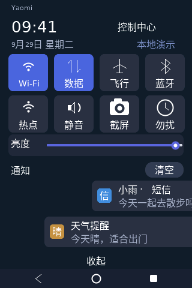 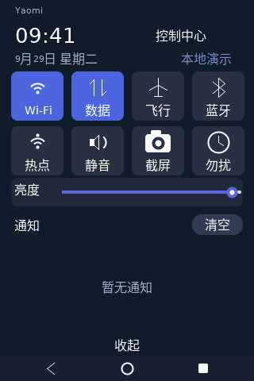

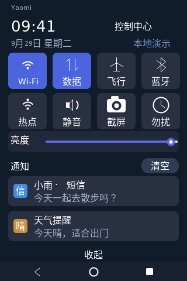 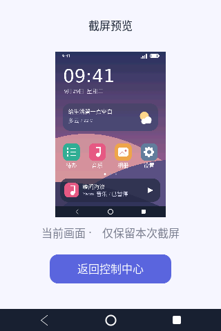

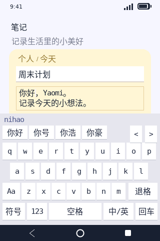 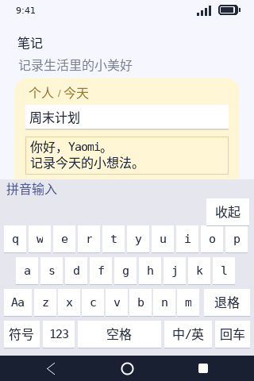 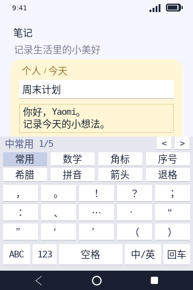

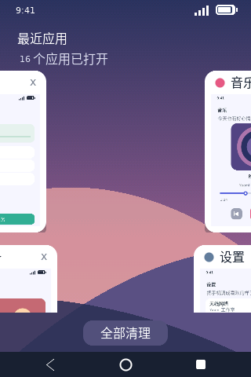 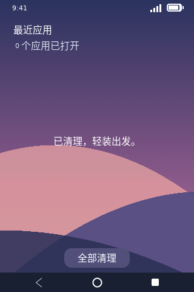

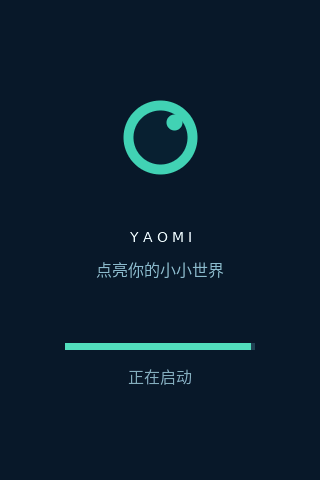 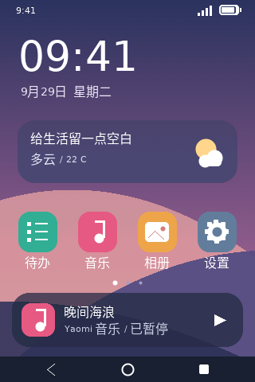 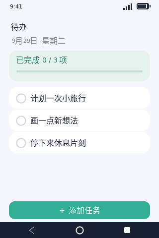 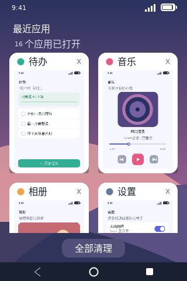 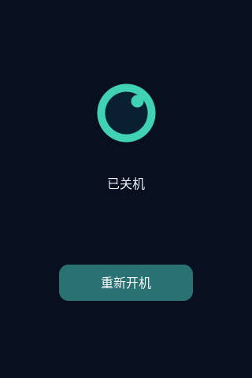

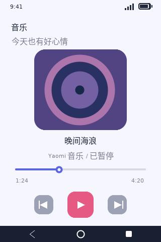 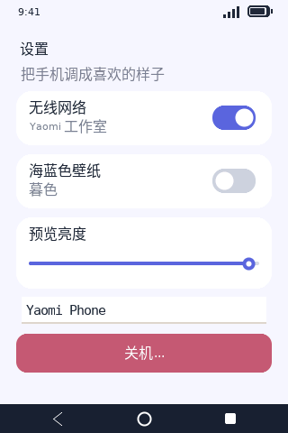 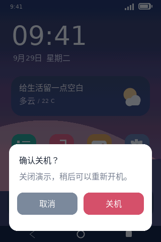

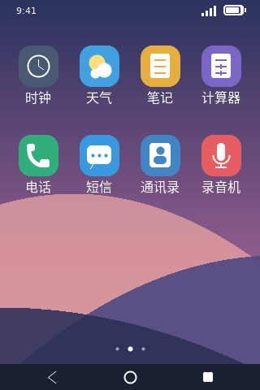 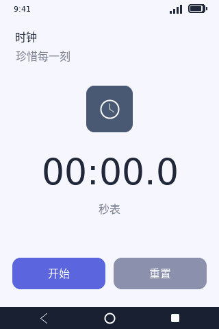 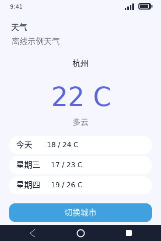 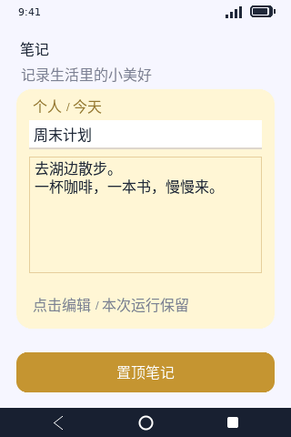 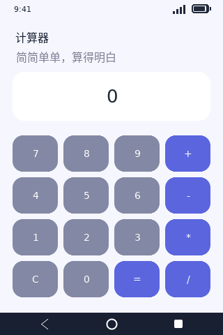

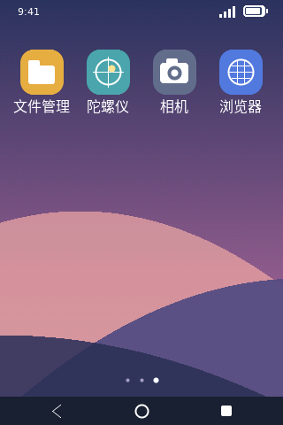

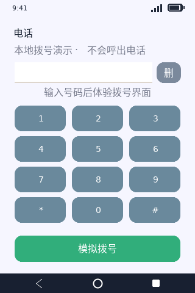 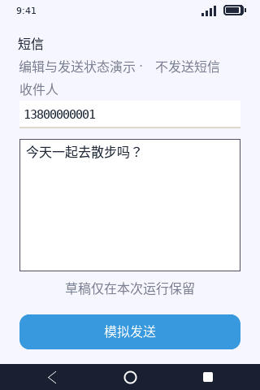 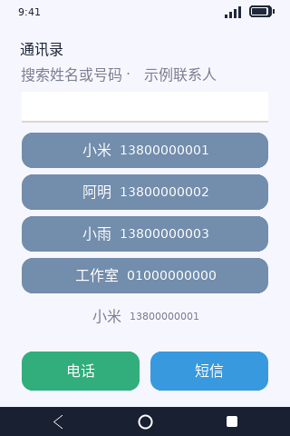 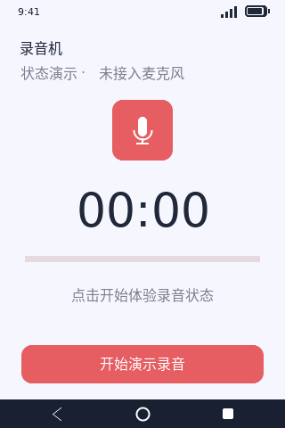

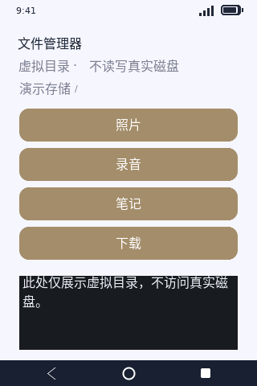 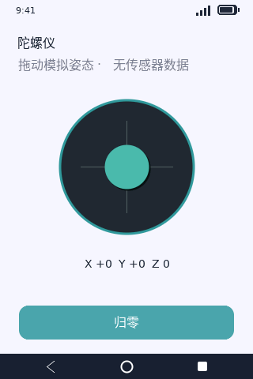 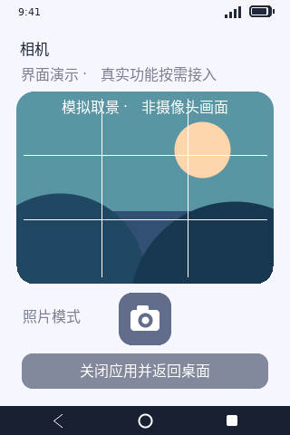 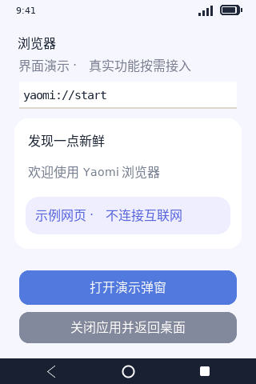

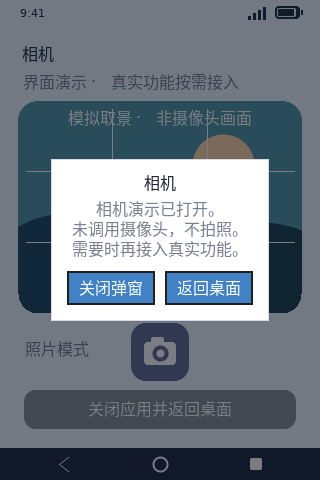 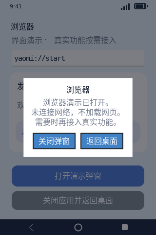
