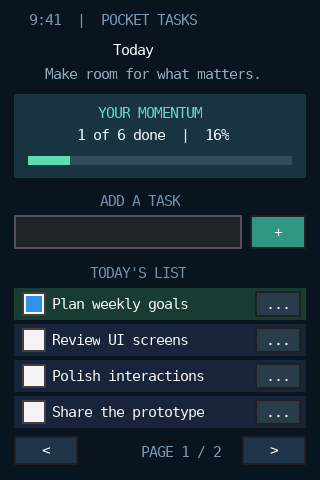
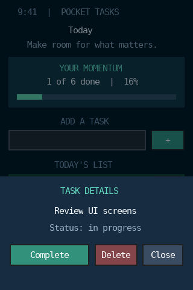

# Pocket Tasks

320×480 竖屏任务小应用。可输入并添加任务、勾选完成、分页浏览，以及打开详情底部面板完成或删除任务。进度和面板在 `YMGUI_ANIM=ON` 时有过渡；`OFF` 时同样的功能直接到达最终状态。

```sh
cmake -S project_Demo/pocket_tasks -B build/rgb565/project_Demo/pocket_tasks -DYMGUI_COLOR_DEPTH=16 -DYMGUI_ANIM=ON
cmake --build build/rgb565/project_Demo/pocket_tasks
build/rgb565/project_Demo/pocket_tasks/pocket_tasks
```

无图形环境可运行 `SDL_VIDEODRIVER=dummy build/rgb565/project_Demo/pocket_tasks/pocket_tasks --selftest`。`--sheet` 在有限帧模式下打开详情面板，便于截图。程序以 SDL 缩放 1 倍输出真实的 320×480 像素窗口。任务只在内存中保存，最多 12 项、每页 4 项；这里不实现手机系统状态栏和软键盘。

 
